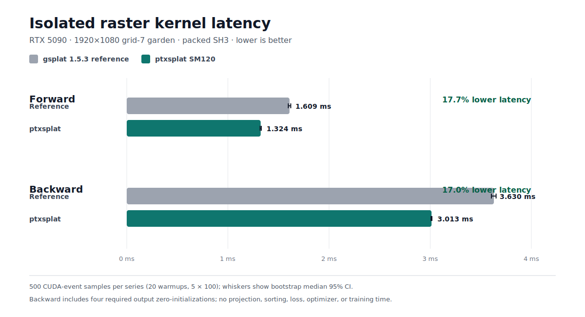

# ptxsplat

`ptxsplat` is an experimental, RTX-optimized fork of
[`gsplat`](https://github.com/nerfstudio-project/gsplat). It starts from gsplat
1.5.3 and keeps the reference CUDA implementation as a correctness oracle and
fallback while architecture-specific kernels are developed for NVIDIA SM120.

The first performance target is differentiable 3D Gaussian rendering on an RTX
5090: one pinhole camera, packed projection, classic RGB rasterization,
spherical harmonics through degree 3, backgrounds, and full backward gradients.

## Kernel Performance

On the fixed 1080p grid-7 garden workload, the promoted SM120 raster kernels
reduce isolated median latency by **17.7% forward** and **17.0% backward**
relative to the inherited gsplat 1.5.3 implementation.



Lower is better. Each series contains 500 CUDA-event samples. Forward is a
controlled same-binary comparison; backward compares the same fixed workload
and timing protocol across the validated reference and final-clean checkpoints.
The backward wrapper includes four required output zero-initializations. These
are isolated raster-stage results, not end-to-end rendering or training claims.
See the [frozen chart data](benchmarks/kernel_benchmark.json) and
[benchmark protocol](docs/BENCHMARKING.md).

## Status

- Python API available as `ptxsplat`.
- Inherited gsplat 1.5.3 kernels remain the reference backend.
- `PTXSPLAT_BACKEND=reference` always selects the inherited reference backend.
- `PTXSPLAT_BACKEND=sm120` selects specialized RGB, tile-size-16 3DGS raster
  forward and backward kernels on compute capability 12.0. `auto` selects
  these paths only for supported calls on SM120 and falls back to reference
  otherwise. Unsupported forward shapes always use the reference kernel; the
  existing explicit-backward validation remains unchanged.
- `PTXSPLAT_SM120_FORWARD_VARIANT=reference` forces only raster forward back to
  the inherited kernel for controlled A/B measurements. `soa384` explicitly
  selects the promoted aligned-staging forward kernel.
- The optional `gsplat` import overload is packaged separately to keep upstream
  gsplat co-installable during development.

Broader end-to-end and training claims remain gated by the reproducible
benchmark protocol in [`docs/BENCHMARKING.md`](docs/BENCHMARKING.md).

## Development Environment

The project uses the existing `360-video-gs-dev:latest` image, which contains
CUDA 12.8, PyTorch 2.9.1, Nsight Compute, and the RTX 5090 toolchain.

```bash
./scripts/docker-run.sh -- python3 -m pip install -e .
./scripts/docker-run.sh -- pytest -q tests
./scripts/run-codex-in-docker.sh
```

Nsight Compute needs GPU performance-counter permission on this host. Launch
the isolated container with the profiling capability only when required:

```bash
./scripts/run-codex-in-docker.sh --profile
./scripts/docker-run.sh --profile -- ncu --set full <command>
```

For unattended work, authenticate once and run the supervised launcher in a
detached host-side `tmux` session. It pins Sol/xhigh and retries failed CLI
runs without selecting a lower-effort fallback:

```bash
./scripts/docker-run.sh -- codex login --device-auth
tmux new-session -d -s ptxsplat \
  "cd $(pwd) && exec ./scripts/run-codex-supervised.sh"
```

The retry interval defaults to 30 minutes and can be changed with
`PTXSPLAT_CODEX_RETRY_SECONDS`. Logs are written to
`.bcodex/autonomous-codex.log`. The supervisor does not grant `SYS_ADMIN` by
default. Set `PTXSPLAT_CODEX_PROFILE=1` only for a run that needs Nsight Compute
performance counters.

The launcher mounts only this repository and a dedicated Codex/cache state
directory. It does not mount the host home, SSH configuration, datasets, or the
Docker socket.

## Installation

Install the development package:

```bash
python3 -m pip install -e .
```

The release extra installs a separately built compatibility distribution that
provides `gsplat.*` imports:

```bash
python3 -m pip install 'ptxsplat[gsplat_overload]'
```

Python package extras cannot satisfy another project's `Requires-Dist: gsplat`
metadata. Applications with a hard dependency on the official distribution
must adjust that dependency or install their application with dependency
resolution disabled after installing the overload.

## Documentation

- [`docs/ROADMAP.md`](docs/ROADMAP.md): implementation and optimization phases.
- [`docs/CORRECTNESS.md`](docs/CORRECTNESS.md): diagnostic scenes and parity
  policy.
- [`docs/BENCHMARKING.md`](docs/BENCHMARKING.md): benchmark and roofline method.
- [`docs/PERFORMANCE_STUDY.md`](docs/PERFORMANCE_STUDY.md): methodology and
  backlog for the deferred multi-scene performance-history study; no results
  are claimed there.

## Attribution

The baseline implementation and much of the initial test suite come from
gsplat 1.5.3. Upstream copyright and Apache-2.0 license notices are retained.
See [`CITATION.bib`](CITATION.bib) for the upstream citation.
